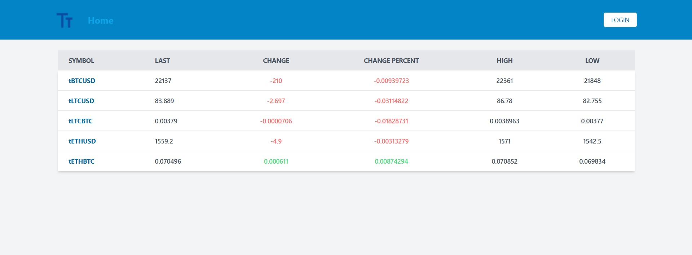

# Crypto Market WebSocket Dashboard

## About

Crypto market app made with Vite, React + TailwindCSS + TypeScript and WebSockets using [Bitfinex API](https://docs.bitfinex.com/).

### Examples

Home page when user is not logged in(fetching through websocket with live updates): 

Handling unauthorized access (based on [South Park S02E04](https://www.southparkstudios.com/episodes/c1m717/south-park-chickenlover-season-2-ep-4)): 

Home page when user is logged in: 

Details page(fetching from REST API without live updates): 

Favorites page(fetching through websocket with live updates): 

404 page (based on [South Park S11E10](https://www.southparkstudios.com/episodes/e1yoxn/south-park-imaginationland-season-11-ep-10)): 

### Config

Application was made with Vite and not Create-React-App, so proxy was handled this way: 

### Libraries

- [Vite 4](https://vitejs.dev/)
- [React 18](https://reactjs.org/)
- [TypeScript 4.9.5](https://www.typescriptlang.org/)
- [Axios](https://axios-http.com/docs/intro)
- [TailwindCSS 3](https://tailwindcss.com/)

### Tools

- [commitlint 17](https://commitlint.js.org)
- [Conventional Commits 1](https://www.conventionalcommits.org)
- [editorconfig](https://editorconfig.org/)
- [eslint 8](https://eslint.org/)
- [husky 8](https://typicode.github.io/husky/#/)
- [Prettier 2](https://prettier.io/)
- [VS Code settings](https://code.visualstudio.com/)

### Running

```bash
yarn
yarn dev
```
